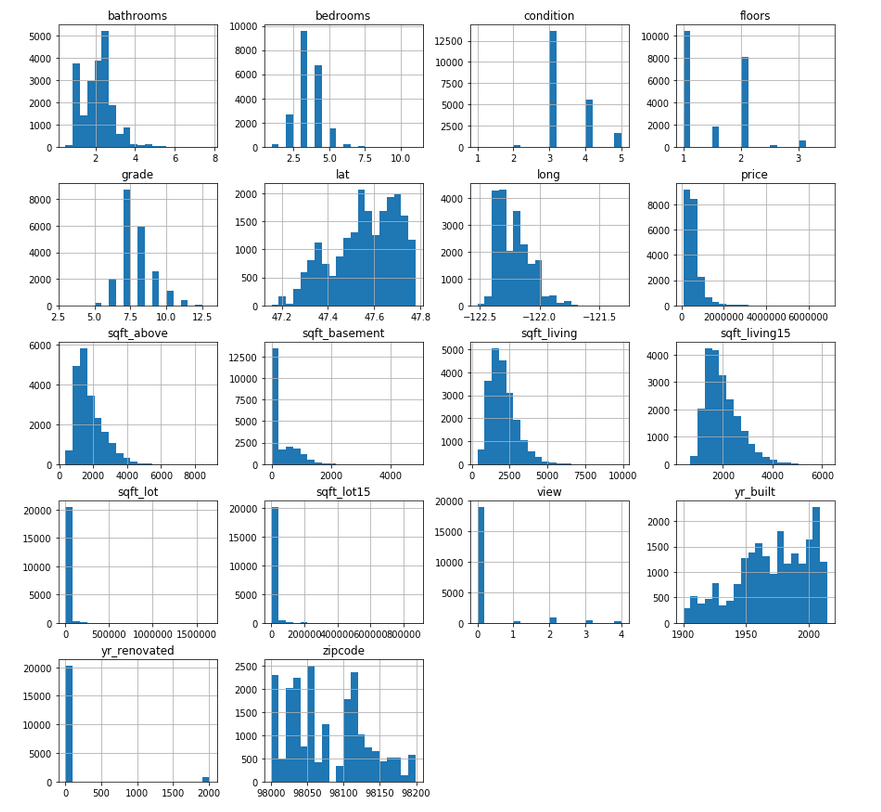
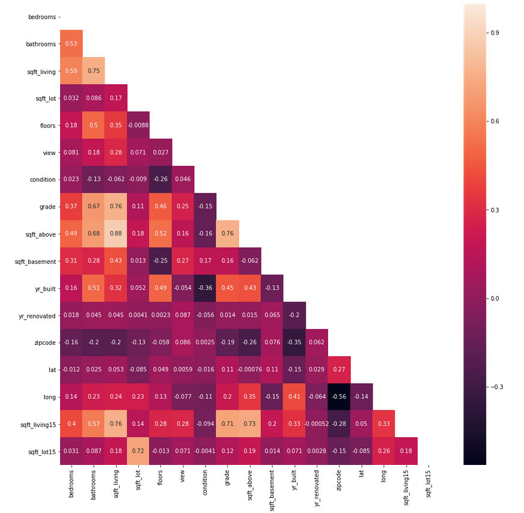
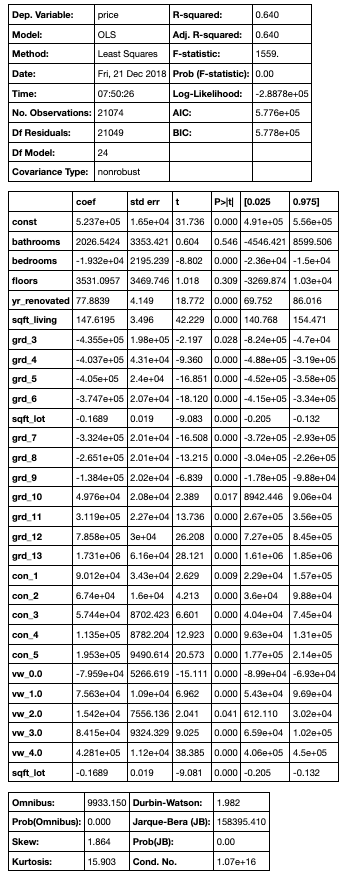

# House Sales in King County

### Objectives

* Data cleaning
* Regression Model

This project attepts to predict the sale price of houses in King County, one of the most populous county in WA State. The data set has been provided (and modified) in the form of a csv file and can be found in the home directory. The project requirements and expected observations from this study can be found in the index.ipynb file.

### Questions

* What to expect in King county? What can be inferred from the descriptive statistics (central tendency of the dataset)
* How zipcode affects price?
* How age and condition impact price?

### Variable Distribution

### Feature Correlation Map

### Linear Regression using Statsmodel

### Interpretation

##### What to expect in King county?

    Average Price: 450,000
    3 bedrooms / 2.25 bathrooms
    Living area around 1,910 square feet + Backyard
    Build in the 70's
    Average condition, will need minor repairs

##### How zipcode affects price?¶
No relatioship can be stablished between zipcode and price, its correlation is very close to 0. About 42% of zipcodes are missing in the dataset, that can affect the relation with price. (Zip codes in King County: 120; zip codes in the set: 70

##### Does the age of a house has an impact on its price?
There seems to be no stablished correlation, only a few houses built in the past few years appear to be at a high cost.

### Recommedations

Accuracy: 64% 

#### New Houses
* Ample living space. 
* Average of 5 rooms. 
* Use high quality materials and fixtures. 

#### Old Houses  
* Keep house in average condition, make sure all components are functional. 
* If renovating, add more rooms and use good quality fixtures. 
* Create more living space if possible. 

